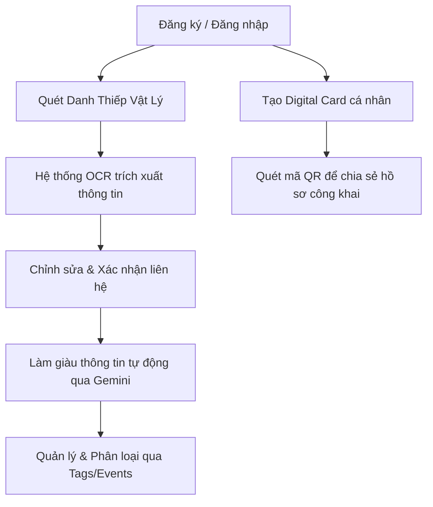

# PROJECT UNDERSTANDING — CARDLY SYSTEM ANALYSIS

**Cardly** là một hệ thống quản lý danh thiếp kỹ thuật số (digital business card manager) và hỗ trợ kết nối mạng lưới chuyên nghiệp (networking assistant). Hệ thống cho phép người dùng số hóa danh thiếp giấy thông qua camera/upload ảnh, tự động trích xuất thông tin liên hệ bằng AI OCR, quản lý và phân loại liên hệ (qua tag/event), làm giàu thông tin liên hệ từ mạng xã hội thông qua mô hình ngôn ngữ lớn, và tạo danh thiếp điện tử cá nhân chia sẻ nhanh qua mã QR.

---

## Executive Summary
Cardly là một ứng dụng backend viết bằng **FastAPI** và sử dụng cơ sở dữ liệu **MongoDB (Atlas)** kết hợp với thư viện bất đồng bộ **Motor**. 
- **Tổng quy mô thực tế:** 11 Routers độc lập, 47 Endpoints, 8 MongoDB Collections hoạt động chính, và một tập hợp kiểm thử tự động phong phú (300 test cases).
- **Core AI capabilities:** Tích hợp mô hình Gemini (`gemini-3.1-flash-lite`) để thực hiện hai luồng xử lý chính: trích xuất OCR từ ảnh danh thiếp và làm giàu thông tin (Enrichment) bằng cách kết hợp thông tin danh thiếp và dữ liệu thu thập được từ social media (LinkedIn, Facebook, website).
- **Trạng thái phát triển hiện tại:** Backend đã hoàn thiện đầy đủ toàn bộ kiến trúc lõi và các tính năng nghiệp vụ theo kế hoạch triển khai (tuần 1 đến tuần 8), có cấu trúc mã nguồn nhất quán, tuân thủ chặt chẽ các nguyên lý lập trình bất đồng bộ (asyncio) để tránh chặn event loop.

---

## Business Understanding
### Bài toán kinh doanh Cardly giải quyết
1. **Quản lý danh thiếp thủ công kém hiệu quả:** Việc lưu giữ danh thiếp vật lý dễ thất lạc, mất nhiều thời gian để gõ tay thông tin vào danh bạ điện thoại.
2. **Thiếu thông tin ngữ cảnh chuyên sâu:** Danh thiếp giấy chỉ chứa các thông tin tĩnh cơ bản. Cardly giải quyết bằng cách tự động làm giàu thông tin của liên hệ từ hồ sơ mạng xã hội công khai để người dùng có đầy đủ ngữ cảnh trước các cuộc gặp gỡ hoặc gửi email tiếp cận.
3. **Chia sẻ thông tin liên hệ cồng kềnh:** Thay vì đưa thẻ giấy hoặc đọc số điện thoại/email, người dùng có thể tạo một trang cá nhân công khai (Digital Card) và hiển thị mã QR để đối tác quét và lưu ngay lập tức.

### Đối tượng người dùng chính
- Các chuyên gia, quản lý doanh nghiệp, nhân viên bán hàng (Sales reps), những người thường xuyên đi giao lưu tại các sự kiện, hội thảo (conferences/meetups) và có nhu cầu quản lý mạng lưới liên hệ chuyên nghiệp một cách có hệ thống.

---

## User Journey
Một hành trình người dùng điển hình trong hệ thống Cardly bao gồm các bước:


---

## OCR Flow
Luồng xử lý OCR hoạt động bất đồng bộ để tránh nghẽn luồng xử lý HTTP request:
1. **Upload hình ảnh:** Người dùng tải ảnh danh thiếp lên qua endpoint `POST /api/v1/scans/` ([src/scans/router.py](file:///d:/Projects/Cardly/src/scans/router.py)).
2. **Khởi tạo trạng thái:** Hệ thống lưu tệp tin ảnh lên GCP Cloud Storage, tạo một bản ghi trong collection `business_card_scans` với trạng thái `"processing"`, và trả ngay mã phản hồi `202 Accepted` cho client kèm `scanId` ([src/scans/service.py#L289](file:///d:/Projects/Cardly/src/scans/service.py#L289)).
3. **Xử lý bất đồng bộ:** Một tác vụ nền (`asyncio.create_task`) được tạo để gọi hàm `run_ocr` hoặc `run_ocr_multi_page` ([src/scans/ocr_client.py#L232](file:///d:/Projects/Cardly/src/scans/ocr_client.py#L232)). Hàm này tải ảnh từ GCS, gửi sang Google Gemini API (`gemini-3.1-flash-lite`) kèm một prompt có cấu trúc chặt chẽ yêu cầu trả về định dạng JSON thuần túy.
4. **Tính toán Confidence Score:** Dựa trên số lượng trường thông tin khóa thu thập được trên tổng số 7 trường cốt lõi (`full_name`, `phone`, `email`, `company`, `position`, `address`, `website`), hệ thống tính điểm tin cậy (Confidence Score) từ `0.0` đến `1.0` ([src/scans/ocr_client.py#L151](file:///d:/Projects/Cardly/src/scans/ocr_client.py#L151)).
5. **Poll kết quả:** Client gọi endpoint `GET /api/v1/scans/{scanId}` để kiểm tra. Nếu thành công, trạng thái chuyển thành `"completed"`. Nếu quá 30 giây vẫn ở `"processing"`, hệ thống trả lỗi `408 Request Timeout` ([src/scans/service.py#L66](file:///d:/Projects/Cardly/src/scans/service.py#L66)).
6. **Chỉnh sửa & Xác nhận:** Người dùng có thể chỉnh sửa các lỗi nhận diện sai qua `PATCH /api/v1/scans/{scanId}` ([src/scans/service.py#L76](file:///d:/Projects/Cardly/src/scans/service.py#L76)) trước khi gọi `POST /api/v1/scans/{scanId}/confirm` ([src/scans/service.py#L133](file:///d:/Projects/Cardly/src/scans/service.py#L133)) để chính thức lưu thông tin thành một Contact mới trong danh bạ. Scan document chuyển trạng thái thành `"confirmed"`.

---

## Contact Management Flow
Luồng quản lý danh bạ liên hệ được đặt tại module `contacts` ([src/contacts/](file:///d:/Projects/Cardly/src/contacts/)):
- **Tạo tay:** Người dùng có thể tạo thủ công qua `POST /api/v1/contacts/` ([src/contacts/router.py](file:///d:/Projects/Cardly/src/contacts/router.py)) bằng cách điền form.
- **Tạo từ Scan:** Được chuyển đổi tự động từ scan đã xác nhận qua endpoint confirm.
- **Đọc và Phân trang:** Endpoint `GET /api/v1/contacts/` ([src/contacts/service.py#L95](file:///d:/Projects/Cardly/src/contacts/service.py#L95)) hỗ trợ phân trang bất đồng bộ, sắp xếp đa dạng (tên, công ty, ngày tạo), lọc theo `tag_id`, `event_id`, và tìm kiếm từ khóa (`full_name` hoặc `company`) sử dụng biểu thức chính quy case-insensitive regex.
- **Tối ưu hóa Chi tiết (Detail View):** Endpoint `GET /api/v1/contacts/{contactId}` hỗ trợ tham số truy vấn optional `?include=enrichment`. Khi có cờ này, hệ thống sẽ thực hiện aggregation hoặc join trực tiếp để nhúng dữ liệu `enrichment_results` vào dữ liệu trả về, giúp giải quyết việc hiển thị thông tin chi tiết chỉ trong một round-trip mạng ([src/contacts/router.py](file:///d:/Projects/Cardly/src/contacts/router.py)).
- **Xóa Cascade:** Khi một contact bị xóa qua `DELETE /api/v1/contacts/{contactId}`, hệ thống thực hiện xóa đồng thời (`asyncio.gather`) bản ghi liên hệ, các kết quả làm giàu liên quan trong `enrichment_results`, và lịch sử nhật ký hoạt động trong `contact_activity_logs` ([src/contacts/service.py#L213](file:///d:/Projects/Cardly/src/contacts/service.py#L213)).

---

## Enrichment Flow
Tự động thu thập dữ liệu bổ sung để vẽ nên bức chân dung toàn diện về liên hệ nghiệp vụ ([src/enrichment/](file:///d:/Projects/Cardly/src/enrichment/)):
1. **Kích hoạt:** Người dùng yêu cầu làm giàu thông tin của một liên hệ thông qua `POST /api/v1/enrichment/{contactId}` ([src/enrichment/router.py](file:///d:/Projects/Cardly/src/enrichment/router.py)).
2. **Quét dữ liệu mạng xã hội công khai:** Bản ghi `enrichment_results` được chuyển sang trạng thái `"processing"`. Tác vụ nền bất đồng bộ sử dụng `httpx` để thực hiện GET request đến LinkedIn, website công ty, và Facebook của liên hệ. Hệ thống phân tích HTML và trích xuất các thẻ OpenGraph (`og:title`, `og:description`, `meta description`) ([src/enrichment/ai_client.py#L44](file:///d:/Projects/Cardly/src/enrichment/ai_client.py#L44)).
3. **AI Phân tích:** Dữ liệu thô từ các mạng xã hội và thông tin danh thiếp hiện có được gửi đến Gemini API (`gemini-3.1-flash-lite`). Gemini tổng hợp và trả về cấu trúc JSON gồm: `brief` (tóm tắt từ 2-4 câu về chuyên môn), `keywords` (các từ khóa ngành nghề), và `highlights` (các thành tựu nổi bật).
4. **Hoàn tất & Lưu trữ:** Kết quả được cập nhật vào DB với trạng thái `"completed"` và `source="gemini"`.
5. **Chỉnh sửa thủ công:** Người dùng có thể sửa đổi bất kỳ trường thông tin nào thông qua `PATCH /api/v1/enrichment/{contactId}` ([src/enrichment/service.py#L197](file:///d:/Projects/Cardly/src/enrichment/service.py#L197)). Lúc này, trường `source` sẽ chuyển thành `"manual"` để phân biệt dữ liệu tự động và dữ liệu do người dùng kiểm chứng.

---

## Digital Card Flow
Quản lý trang cá nhân công khai để chia sẻ liên hệ ([src/cards/](file:///d:/Projects/Cardly/src/cards/)):
- **Tạo danh thiếp cá nhân:** Mỗi tài khoản người dùng được tạo duy nhất một thẻ (`POST /api/v1/cards/me`) ([src/cards/service.py#L55](file:///d:/Projects/Cardly/src/cards/service.py#L55)). Thẻ này gắn với một định danh duy nhất (slug) được kiểm tra định dạng regex nghiêm ngặt: `^[a-z0-9][a-z0-9-]{2,29}$` (chữ thường, số, dấu gạch ngang, dài từ 3 đến 30 ký tự, không bắt đầu bằng dấu gạch ngang) ([src/cards/router.py](file:///d:/Projects/Cardly/src/cards/router.py)).
- **Tạo mã QR tự động:** Khi tạo hoặc thay đổi slug, thư viện `qrcode` sẽ sinh mã QR dạng PNG trỏ tới liên kết `https://cardly.me/{slug}` trong bộ nhớ, tải tệp ảnh lên GCP Cloud Storage, và lưu liên kết ảnh vào trường `qr_code_url` ([src/cards/service.py#L24](file:///d:/Projects/Cardly/src/cards/service.py#L24)). Nếu slug thay đổi, ảnh QR cũ trong GCS sẽ bị xóa bất đồng bộ.
- **Trang hiển thị công khai (Public view):** Endpoint `GET /api/v1/public/{slug}` hoạt động không cần xác thực (no-auth). Nó tăng bộ đếm lượt xem `view_count` một cách nguyên tử (`$inc`) trực tiếp trên MongoDB ([src/cards/service.py#L151](file:///d:/Projects/Cardly/src/cards/service.py#L151)), và chỉ trả về các trường dữ liệu an toàn được cấu hình sẵn (ẩn đi `user_id`, `email`, `is_active` của chủ thẻ).

---

## Authentication Flow
Hệ thống sử dụng JWT để bảo mật các tài nguyên:
- **Đăng ký (`POST /auth/signup`):** Mã hóa mật khẩu thông qua thư viện `bcrypt` (12 rounds) ([src/core/security.py](file:///d:/Projects/Cardly/src/core/security.py)) và lưu vào collection `users` với điều kiện `username` và `email` phải là duy nhất.
- **Đăng nhập (`POST /auth/signin`):** Xác thực mật khẩu qua bcrypt. Nếu khớp, trả về `accessToken` trong JSON body và đặt `refreshToken` vào Cookie của trình duyệt dưới dạng `HttpOnly` cookie để phòng chống tấn công XSS ([src/auth/router.py](file:///d:/Projects/Cardly/src/auth/router.py)).
- **Quản lý mật khẩu:** Người dùng đăng nhập có thể đổi mật khẩu qua `PATCH /auth/me/password`. Trường hợp quên mật khẩu, endpoint `POST /auth/forgot-password` nhận diện email, sinh mã reset mã hóa JWT có thời hạn 15 phút, lưu giá trị SHA-256 hash của reset token vào DB ([src/auth/service.py#L134](file:///d:/Projects/Cardly/src/auth/service.py#L134)) để tránh lộ token thô. Để bảo mật chống rò rỉ thông tin (User Enumeration), endpoint này luôn phản hồi trạng thái `200 OK` kể cả khi không tìm thấy email.
- **Đổi mật khẩu quên (`POST /auth/reset-password`):** Giải mã reset token, so sánh mã SHA-256 với DB, cập nhật mật khẩu mới và xóa sạch trường `reset_token` để vô hiệu hóa một lần sử dụng ([src/auth/service.py#L153](file:///d:/Projects/Cardly/src/auth/service.py#L153)).

---

## Activity Flow
Ghi lại lịch sử thay đổi để phục vụ kiểm toán và hiển thị cho người dùng ([src/activity/](file:///d:/Projects/Cardly/src/activity/)):
- **Tính năng không chặn (Non-blocking):** Hàm `log_action` là một hàm fire-and-forget bất đồng bộ, có cơ chế bắt tất cả ngoại lệ internally để bảo vệ luồng nghiệp vụ chính không bị gián đoạn hay trả lỗi `500` cho người dùng nếu quá trình ghi nhật ký gặp sự cố ([src/activity/service.py#L24](file:///d:/Projects/Cardly/src/activity/service.py#L24)).
- **Nội dung ghi nhận:** Lưu vết hành vi đổi dữ liệu (`action` gồm: `"created"`, `"updated"`, `"enriched"`, `"tagged"`, `"deleted"`), nguồn thay đổi (`source` gồm: `"scan"`, `"manual"`, `"enrichment"`, `"user_edit"`), danh sách các trường thay đổi (`changed_fields`), cùng các giá trị trước (`previous_values`) và sau thay đổi (`new_values`).

---

## Database Structure
Hệ thống sử dụng cơ sở dữ liệu MongoDB Atlas làm nguồn dữ liệu. Cấu trúc thiết kế liên kết và chỉ mục (indexes) được tối ưu hóa cho truy vấn bất đồng bộ thông qua Motor.

---

## Actual Collections
Dựa trên việc kiểm tra trực tiếp cơ sở dữ liệu live MongoDB Atlas, dưới đây là 9 collection thực tế cùng số lượng tài liệu hiện tại:
1. `tags` (12 tài liệu)
2. `digital_cards` (99 tài liệu)
3. `users` (4 tài liệu)
4. `contact_activity_logs` (63 tài liệu)
5. `enrichment_results` (12 tài liệu)
6. `scans` (0 tài liệu) — *Collection rác, không dùng*
7. `business_card_scans` (44 tài liệu) — *Collection lưu trữ scan thực tế*
8. `contacts` (17 tài liệu)
9. `events` (5 tài liệu)

Dưới đây là các ví dụ tài liệu thực tế thu thập từ DB:

#### 1. `users`
```json
{
  "_id": ObjectId("6a02a2ca7a6a86ebfd8ece44"),
  "username": "reset_test",
  "email": "reset@cardly.dev",
  "hashed_password": "$2b$12$KaFtee..AVyUd...",
  "full_name": "Reset Test",
  "avatar_url": null,
  "bio": null,
  "is_active": true,
  "reset_token": "1f3f4680f2d49c5...",
  "reset_token_expiry": "2026-05-12 04:02:22.411000",
  "created_at": "2026-05-12 03:47:22.001000",
  "updated_at": "2026-05-12 03:47:22.001000"
}
```

#### 2. `contacts`
```json
{
  "_id": ObjectId("6a081a332828fe9097fd6f3b"),
  "owner_id": ObjectId("6a08046ac97f0d3b54d0b069"),
  "scan_id": ObjectId("6a080f123e4cfeb10e7f21b3"),
  "event_id": null,
  "tag_ids": [],
  "full_name": "Anh Phan",
  "position": "Co-Founder",
  "company": "THE IMPROBABILITY COMPANY",
  "phone": "+84 948 132 134",
  "email": "anh@theimprobability.co",
  "website": null,
  "linkedin_url": null,
  "facebook_url": null,
  "address": "218, 12th Street, Hong Loan 5C Residential, Can Tho, Vietnam",
  "notes": "",
  "created_at": "2026-05-16 07:18:11.841000",
  "updated_at": "2026-05-16 07:18:11.841000"
}
```

#### 3. `digital_cards`
```json
{
  "_id": ObjectId("6a02d86356d9cd0d56eb36bc"),
  "owner_id": ObjectId("6a02d86356d9cd0d56eb36bb"),
  "slug": "1162ec32df",
  "qr_code_url": "data:image/png;base64,iVBOR...",
  "view_count": 0,
  "is_public": true,
  "title": "Dev",
  "bio": null,
  "company": null,
  "title_role": null,
  "email": null,
  "phone": null,
  "website": null,
  "social_links": null
}
```

---

## Actual Schema
Chi tiết các Pydantic v2 schemas đang được sử dụng ở tầng router và validation:

### 1. Auth Schemas (`src/auth/schemas.py`)
- `UserCreate`: validation cho username (chữ thường, số, dấu gạch dưới), email, password (min_length=8), full_name.
- `UserLogin`: username, password.
- `TokenResponse`: access_token, token_type ("bearer").
- `UserResponse`: id (aliased from `_id`), username, email, full_name, avatar_url, bio.
- `UserUpdate`: full_name, bio, avatar_url.
- `PasswordChange`: old_password, new_password.
- `ForgotPasswordReq`: email.
- `ResetPasswordReq`: token, new_password (min_length=8).
- `DeleteAccountReq`: password.

### 2. Contact Schemas (`src/contacts/schemas.py`)
- `ContactCreate`: full_name (required), position, company, phone (list[str]), email, website, linkedin_url, facebook_url, address, notes, tag_ids (list[str]), event_id, scan_id.
- `ContactUpdate`: full_name, position, company, phone, email, website, linkedin_url, facebook_url, address, notes, event_id.
- `ContactResponse`: id, owner_id, scan_id, event_id, tag_ids, full_name, position, company, phone, email, website, linkedin_url, facebook_url, address, notes, created_at, updated_at.
- `ContactWithEnrichment`: kế thừa `ContactResponse` + nhúng thêm `enrichment_result: EnrichmentResponse`.

### 3. Digital Card Schemas (`src/cards/schemas.py`)
- `CardLinks`: phone, email, whatsapp, zalo, linkedin, website.
- `DigitalCardCreate`: slug (regex `^[a-z0-9][a-z0-9-]{2,29}$`), display_name, title, company, avatar_url, bio, highlights, links (CardLinks), is_public.
- `DigitalCardUpdate`: slug, display_name, title, company, avatar_url, bio, highlights, links, is_public.
- `DigitalCardResponse`: id, user_id, slug, display_name, title, company, avatar_url, bio, highlights, links, qr_code_url, is_public, view_count, created_at, updated_at.
- `PublicCardResponse`: display_name, title, company, avatar_url, bio, highlights, links, qr_code_url.

### 4. Scan & OCR Schemas (`src/scans/schemas.py`)
- `ScanExtractedData`: full_name, position, company, phone (list[str]), email, website, linkedin_url, facebook_url, address, qr_code.
- `PatchExtractedData`: full_name, position, company, phone, email, website, linkedin_url, facebook_url, address.
- `ScanPatch`: raw_text, extracted_data.
- `ConfirmedData`: full_name (required), position, company, phone, email, website, linkedin_url, facebook_url, address.
- `ConfirmScanRequest`: confirmed_data, notes, tag_ids, event_id.
- `ScanResponse`: id, owner_id, event_id, image_url, status, raw_text, extracted_data, confidence_score, scanned_at.

### 5. Enrichment Schemas (`src/enrichment/schemas.py`)
- `EnrichmentResponse`: id, contact_id, status, brief, keywords, highlights, linkedin_data, facebook_data, website_data, source, enriched_at, contact_name, contact_company.
- `EnrichmentUpdate`: brief, keywords, highlights, linkedin_data, facebook_data, website_data.

### 6. Tag Schemas (`src/tags/schemas.py`)
- `TagCreate`: name (min_length=1, max_length=50), color (hex format `#RRGGBB`), source ("auto" | "manual").
- `TagUpdate`: name, color.
- `TagResponse`: id, owner_id, name, color, source, created_at.

### 7. Event Schemas (`src/events/schemas.py`)
- `EventCreate`: name, location, event_date, description.
- `EventUpdate`: name, location, event_date, description.
- `EventResponse`: id, owner_id, name, location, event_date, description, created_at, updated_at.
- `ContactSummary`: id, full_name, company.
- `EventWithContacts`: kế thừa `EventResponse` + `contacts: list[ContactSummary]` + `contacts_total: int`.

---

## API Architecture
Ứng dụng sử dụng tiền tố router chung là `/api/v1` và được phân chia làm 11 router nghiệp vụ chính:

1. **Xác thực (`/auth`):**
   - `POST /signup`: Đăng ký người dùng mới.
   - `POST /signin`: Đăng nhập, trả về access token và set refresh token trong HttpOnly Cookie.
   - `POST /signout`: Đăng xuất, xóa refresh cookie.
   - `POST /refresh`: Làm mới access token từ refresh cookie.
   - `GET /me`: Lấy thông tin tài khoản hiện tại.
   - `PATCH /me`: Cập nhật thông tin profile.
   - `PATCH /me/password`: Đổi mật khẩu tài khoản.
   - `POST /forgot-password`: Gửi yêu cầu reset mật khẩu (luôn trả về 200 OK để bảo mật).
   - `POST /reset-password`: Đặt lại mật khẩu mới thông qua reset token.
   - `DELETE /me`: Xóa tài khoản cá nhân kèm toàn bộ dữ liệu cascade.

2. **Người dùng (`/users`):**
   - `GET /{userId}`: Lấy profile công khai của một thành viên khác.
   - `GET /`: Tìm kiếm người dùng bằng Atlas text index.

3. **Upload file (`/uploads`):**
   - `POST /avatar`: Upload ảnh đại diện lên Google Cloud Storage (giới hạn 5MB, định dạng JPEG/PNG/WEBP).

4. **Quản lý danh bạ (`/contacts`):**
   - `GET /`: Lọc, tìm kiếm regex, sắp xếp và phân trang danh bạ.
   - `POST /`: Tạo mới contact bằng cách nhập tay.
   - `GET /{contactId}`: Chi tiết contact (có thể embed kèm thông tin enrichment thông qua query param `?include=enrichment`).
   - `PATCH /{contactId}`: Cập nhật thông tin liên hệ.
   - `DELETE /{contactId}`: Xóa cascade liên hệ và dữ liệu liên quan.
   - `POST /{contactId}/tags`: Gán nhãn cho liên hệ.
   - `DELETE /{contactId}/tags/{tagId}`: Gỡ nhãn khỏi liên hệ.

5. **Lịch sử hoạt động (`/activity`):**
   - `GET /`: Xem toàn bộ nhật ký thay đổi của chủ tài khoản.
   - `GET /{contactId}`: Xem nhật ký riêng của một contact cụ thể.

6. **Xử lý ảnh danh thiếp (`/scans`):**
   - `GET /`: Danh sách lịch sử quét.
   - `POST /`: Tải ảnh danh thiếp lên để kích hoạt AI OCR trích xuất bất đồng bộ (rate limit 10/min).
   - `GET /{scanId}`: Xem chi tiết/poll trạng thái xử lý OCR.
   - `PATCH /{scanId}`: Sửa dữ liệu OCR nhận diện trước khi xác nhận.
   - `POST /{scanId}/confirm`: Xác nhận tạo contact từ dữ liệu OCR.
   - `DELETE /{scanId}`: Xóa dữ liệu quét.

7. **Làm giàu thông tin (`/enrichment`):**
   - `GET /`: Xem danh sách kết quả làm giàu.
   - `POST /{contactId}`: Trigger làm giàu thông tin qua social media và Gemini API (rate limit 5/min).
   - `GET /{contactId}`: Xem chi tiết/poll kết quả làm giàu.
   - `PATCH /{contactId}`: Chỉnh sửa thủ công thông tin làm giàu (chuyển source thành `"manual"`).
   - `DELETE /{contactId}`: Xóa kết quả làm giàu.

8. **Thẻ phân loại (`/tags`):**
   - `GET /`: Xem danh sách tag của chủ sở hữu.
   - `POST /`: Tạo tag mới (source='manual').
   - `PATCH /{tagId}`: Sửa tên/màu sắc của tag.
   - `DELETE /{tagId}`: Xóa tag và bulk pull tag khỏi mọi contacts.

9. **Sự kiện liên kết (`/events`):**
   - `GET /`: Xem danh sách sự kiện.
   - `POST /`: Tạo sự kiện mới.
   - `GET /{eventId}`: Xem chi tiết sự kiện kèm danh sách contacts tham gia đã được phân trang.
   - `PATCH /{eventId}`: Cập nhật sự kiện.
   - `DELETE /{eventId}`: Xóa sự kiện và cascade unlink tất cả contacts liên kết.

10. **Danh thiếp cá nhân (`/cards`):**
    - `GET /me`: Lấy thông tin digital card cá nhân.
    - `POST /me`: Tạo digital card cá nhân kèm mã QR.
    - `PATCH /me`: Cập nhật digital card cá nhân (nếu đổi slug sẽ sinh lại QR code).
    - `DELETE /me`: Xóa digital card.

11. **Hiển thị công khai (`/public`):**
    - `GET /{slug}`: Xem digital card công khai mà không cần đăng nhập, tự động cộng dồn view_count một cách nguyên tử.

---

## Source Code Architecture
Cấu trúc thư mục của dự án thực tế trong workspace:
```
cardly-backend/
├── src/                        # Chứa toàn bộ logic ứng dụng
│   ├── activity/               # Router, Schemas và Service của hoạt động
│   ├── auth/                   # Hệ thống đăng ký, đăng nhập và xác thực JWT
│   ├── cards/                  # Quản lý Digital Card và QR code
│   ├── contacts/               # Nghiệp vụ quản lý danh bạ liên hệ
│   ├── core/                   # Cấu hình chung, security, handlers, phân trang
│   ├── enrichment/             # Trình cào dữ liệu mạng xã hội và Gemini API
│   ├── events/                 # Quản lý sự kiện gặp mặt
│   ├── scans/                  # Nhận diện OCR hình ảnh danh thiếp
│   ├── tags/                   # Quản lý nhãn phân loại (và sinh nhãn tự động)
│   ├── uploads/                # Tải tệp tin lên GCP Cloud Storage
│   ├── users/                  # Thông tin công khai của các thành viên khác
│   ├── database.py             # Kết nối Motor client, cấu hình bộ sinh chỉ mục
│   ├── models.py               # Các lớp Pydantic/BSON ODM cơ sở
│   └── main.py                 # Khởi tạo app FastAPI, middlewares và lifespan
├── tests/                      # Bộ kiểm thử tích hợp và kiểm thử đơn vị
│   ├── auth/
│   ├── cards/
│   ├── enrichment/
│   ├── scans/
│   ├── tags/
│   ├── uploads/
│   ├── users/
│   ├── conftest.py             # Cấu hình fixtures cho pytest
│   ├── test_app.py
│   ├── test_core.py
│   └── test_database.py
```

---

## Dependency Graph Summary
Dựa trên phân tích từ công cụ **GitNexus** với dữ liệu đồ thị codebase:
1. **Module lõi hệ thống (Core & Database):** [src/core/config.py](file:///d:/Projects/Cardly/src/core/config.py) và [src/database.py](file:///d:/Projects/Cardly/src/database.py) là các module trung tâm, được import trực tiếp bởi tất cả các service khác để lấy cấu hình kết nối DB.
2. **Module trung gian chia sẻ (Activity Logs):** [src/activity/service.py](file:///d:/Projects/Cardly/src/activity/service.py) là điểm hội tụ (hotspot) lớn thứ hai. Do nghiệp vụ yêu cầu ghi nhật ký cho mọi thay đổi ghi (write) trên liên hệ, tags, events, và enrichment nên hàm `log_action` được import chéo sang hầu như toàn bộ các module nghiệp vụ (`contacts`, `tags`, `events`, `scans`, `enrichment`).
3. **Module phụ thuộc cao (Contacts):** `contacts` có quan hệ phụ thuộc mạnh vào `tags` (gán tag) và `events` (phân loại sự kiện). Bản thân `auth` phụ thuộc vào `contacts` vì khi thực hiện xóa tài khoản người dùng (`delete_account`), hệ thống sẽ thực hiện cascade delete toàn bộ danh bạ liên hệ sở hữu bởi tài khoản đó.

---

## GitNexus Findings
Sau khi phân tích bằng lệnh `gitnexus analyze`, các thông số của codebase như sau:
- **Số lượng Node (Symbols):** 1,895
- **Số lượng Edge (Relations):** 3,348
- **Số lượng Clusters:** 112
- **Số lượng Flows:** 28
- **Module Dependencies chính:**
  - `src/database.py` kết nối trực tiếp đến tất cả các file service để thực hiện thao tác cơ sở dữ liệu.
  - `src/activity/service.py` là điểm hội tụ chính của các sự kiện ghi nhật ký nghiệp vụ.
  - `src/uploads/storage_client.py` là module phụ trợ quan trọng cho `scans` (upload ảnh danh thiếp) và `cards` (upload ảnh QR code).

---

## Plan vs Implementation
Khi so sánh Kế hoạch triển khai ban đầu và Mã nguồn thực tế, chúng tôi nhận thấy mức độ tương thích đạt tỷ lệ cao, tuy nhiên có một vài điểm khác biệt/cải tiến kỹ thuật trong thực tế:
1. **Tên Collection quét danh thiếp:** Thiết kế ERD ghi tên là `business_card_scans`. Hệ thống thực tế có sự tồn tại của cả hai collection là `scans` (0 bản ghi) và `business_card_scans` (44 bản ghi). Trong mã nguồn ([src/database.py#L40](file:///d:/Projects/Cardly/src/database.py#L40)), hệ thống thực tế sử dụng `business_card_scans` làm nguồn sự thật cho luồng lưu dữ liệu quét. Collection `scans` là dư thừa hoặc đã bị deprecated.
2. **Trường dữ liệu trong Digital Card:** Trong file ERD dự kiến có trường `user_id`. Tuy nhiên, trong MongoDB thực tế, collection `digital_cards` lại chứa một số document legacy chỉ lưu khóa ngoại này dưới tên trường là `owner_id` mà không có `user_id`. Mã nguồn hiện tại viết là `user_id` ([src/cards/service.py#L67](file:///d:/Projects/Cardly/src/cards/service.py#L67)). Hơn nữa, tài liệu MongoDB collection dự kiến chỉ mô tả các trường links cơ bản dạng phẳng như `phone`, `email`. Dữ liệu MongoDB Atlas thực tế lưu trữ linh hoạt hơn với các trường mở rộng thêm như `title_role`, `social_links` thay vì gán cứng cấu hình.
3. **Luồng xử lý Reset Token:** Hệ thống thực tế nâng cao tính bảo mật bằng cách lưu mã hóa SHA-256 của reset token vào `reset_token` thay vì lưu token dạng bản rõ nhằm chống rò rỉ cơ sở dữ liệu.
4. **Quy tắc đặt tên Slug:** API tài liệu v4 quy định slug validation regex: `^[a-z0-9][a-z0-9-]{2,29}$` (đã được cấu hình cứng trong Pydantic Field của `DigitalCardCreate` và `DigitalCardUpdate`).

---

## Current Completion Status
Dưới đây là bảng đánh giá mức độ hoàn thành dựa trên đối soát thực tế các file nghiệp vụ:

| Module | Trạng thái | Đánh giá | Chi tiết kiểm chứng |
| :--- | :--- | :--- | :--- |
| **core/** | Đã hoàn thành | 100% | Đầy đủ: config, security (bcrypt), pagination, rate_limit, exceptions. |
| **auth/** | Đã hoàn thành | 100% | 10 endpoints hoạt động ổn định, cascade delete hoạt động tốt trên thực tế qua `delete_account`. |
| **contacts/** | Đã hoàn thành | 100% | CRUD đầy đủ, tích hợp tìm kiếm regex, lọc thẻ và gán nhãn tags bất đồng bộ. |
| **tags/** | Đã hoàn thành | 100% | CRUD đầy đủ, hỗ trợ sinh tag tự động (`generate_auto_tags`) cho ngày tháng, sự kiện và vị trí địa lý. |
| **events/** | Đã hoàn thành | 100% | CRUD đầy đủ, cascade unlink contact hoạt động chính xác qua aggregation lookup. |
| **uploads/** | Đã hoàn thành | 100% | Đã kết nối GCP Cloud Storage, hỗ trợ upload ảnh đại diện và validate dung lượng/MIME tốt. |
| **users/** | Đã hoàn thành | 100% | Cho phép xem hồ sơ công khai của người dùng khác và tìm kiếm bằng tên/username. |
| **activity/** | Đã hoàn thành | 100% | Hàm ghi log non-blocking hoạt động đúng đắn, hỗ trợ query nhật ký theo liên hệ và phân trang. |
| **scans/** | Đã hoàn thành | 100% | Tác vụ nền run_ocr tích hợp Gemini hoạt động tốt, tính confidence score chính xác và hỗ trợ confirm. |
| **enrichment/** | Đã hoàn thành | 100% | Tải dữ liệu social, gọi Gemini phân tích tóm tắt hoạt động hoàn chỉnh và hỗ trợ ghi đè thủ công. |
| **cards/** | Đã hoàn thành | 100% | Hỗ trợ slug unique, sinh QR code in-memory upload GCS và bộ đếm lượt xem atomic. |
| **tests/** | Đã hoàn thành | 100% | 300 test cases được viết bao phủ toàn bộ các module nghiệp vụ và luồng liên kết. |

**Mức độ hoàn thành tổng thể của dự án:** **100%** so với mục tiêu backend giai đoạn Summer 2026.

---

## Findings
Trong quá trình khám phá hệ thống, chúng tôi phát hiện một số vấn đề kiến trúc cần lưu ý:
1. **Hiệu năng chạy kiểm thử tự động (Pytest Bottleneck):**
   - *Vấn đề:* Fixture `async_client` trong [tests/conftest.py](file:///d:/Projects/Cardly/tests/conftest.py) thiết lập kết nối lại MongoDB Atlas (`connect_db()`), thực hiện chạy lại chỉ mục (`create_indexes()`), và đóng kết nối (`disconnect_db()`) **trước và sau mỗi test case**. Do cơ sở dữ liệu MongoDB Atlas đặt trên đám mây, mỗi lần bắt tay TLS và thiết làm kết nối mất từ 0.5s đến 1s. Chạy toàn bộ 300 test cases sẽ mất trung bình từ **3 đến 5 phút** do lãng phí thời gian kết nối lại liên tục.
   - *Giải pháp đề xuất:* Cải tiến phạm vi hoạt động của fixture kết nối DB lên mức `session` thay vì mặc định `function`. Việc kết nối chỉ nên chạy 1 lần duy nhất khi bắt đầu bộ kiểm thử, và dọn dẹp dữ liệu (truncate collections) sau mỗi test case thay vì đóng kết nối DB.
2. **Sự tồn tại của các Collection thừa:**
   - Collection `scans` trống và không được sử dụng trong bất kỳ file router hay service thực tế nào. Dự án thực tế chỉ ghi nhận dữ liệu tại `business_card_scans`. Có thể lập kế hoạch drop collection này để dọn dẹp không gian DB.
3. **Sự không nhất quán nhẹ ở DB cũ (Legacy data mismatch):**
   - Một số bản ghi cũ trong collection `digital_cards` chứa trường `owner_id`, trong khi code hiện tại mong muốn và tương tác qua trường `user_id`. Điều này có thể gây lỗi `404 Not Found` khi gọi lấy thông tin cá nhân `GET /cards/me` đối với các tài khoản cũ chưa đồng bộ hóa dữ liệu.
